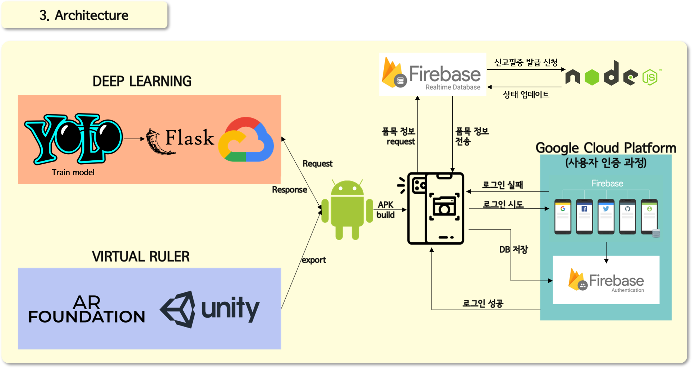

# ECOGREEN
 캡스톤디자인 프로젝트 에코그린  

## 대형 폐기물 배출 어플리케이션

# 시연영상 (유튜브 채널)
https://www.youtube.com/channel/UCT70bDJj1z-kksHOvijeBCg?view_as=subscriber

## 프로젝트 배경
이사/폐업/가구 교체 등의 상황에서 많은 대형폐기물이 발생하고 있으나 대형폐기물 배출요령에 대해서 정확히 파악하고 있는 경우는 드물다. 흔하게 경험할 수 있는 일이 아닐 뿐더러 절차가 복잡하고, 무엇보다 대형폐기물을 처리할 때 드는 수수료의 부과기준이 지역, 품목, 크기별로 달라 매번 찾아보기 번거롭기 때문이다.
우리는 이러한 문제를 해결하기 위해 대형폐기물 배출 절차를 단순화 시켜줄 어플리케이션을 제작하고자 했다.

## 프로젝트 목적
이를 위해 대형 폐기물 배출 안내 어플리케이션에서는 아래의 세 가지 주 기능을 제공하고자 한다.
1. 이미지 탐지 기술을 이용한 품목 인식
2. Virtual Ruler를 이용한 크기 측정
3. 신고필증 자동 작성 및 제공

## 시나리오 설계
1. 앱 가입을 통한 사용자 정보 받아오기(위치정보, 전화번호 등)
2. 대형폐기물 - 폐기 / 재활용 여부에 따라서 해당하는 버튼 클릭
3. 재활용 선택(REUSE): 해당 사용자 인근에 있는 재활용센터 홈페이지 연결
4. 폐기 선택(DISUSE)
  대형 폐기물 품목 입력 - 카메라/갤러리/직접 입력의 방법으로 품목 입력   
  대형 폐기물 규격 측정 - virtual ruler를 활용한 규격 측정
5. 체크리스트 페이지로 이동 - 처리할 품목 리스트(품목명, 규격) 및 수수료 금액 제공
6. 배출 일자 및 배출 장소 입력 후 결제 안내 페이지로 이동
7. 관리자페이지에서 승인을 하면 pdf 형식의 신고필증 제공 및 이메일 전송   

## 프로젝트 아키텍처
  

## Reference
- 구글 이미지 웹크롤링    
https://www.youtube.com/watch?v=1b7pXC1-IbE   
- Quickstart for Android | ARCore    
https://developers.google.com/ar/develop/unity/quickstart-android    
- Explore the HelloAR sample app code | ARCore    
https://developers.google.com/ar/develop/unity/tutorials/hello-ar-sample    
- AR Measure | Camera | Unity Asset Store    
https://assetstore.unity.com/packages/tools/camera/ar-measure-145104       
- AR Core Ruler - Master ARCore 1.3 Unity SDK - Build 6 Augmented Reality Apps    
https://subscription.packtpub.com/video/application_development/9781789537413/70319/70320/ar-core-ruler    
- Android Studio(패스트캠퍼스 온라인 강의 - 올인원 패키지: 모바일 앱 개발)    
https://github.com/changja88  

## 기술블로그
### [Deep Learning]
https://syeong622.tistory.com/category/Develop/%EC%A1%B8%EC%97%85%ED%94%84%EB%A1%9C%EC%A0%9D%ED%8A%B8

### [AR: Virtual Ruler]
유니티에서 ARCore 시작하기: https://iszero-tech.tistory.com/1   
HelloAR: https://iszero-tech.tistory.com/2   
AR Ruler①: https://iszero-tech.tistory.com/3   
AR Ruler②: https://iszero-tech.tistory.com/4   
Virtual Ruler 중간정리: https://iszero-tech.tistory.com/5   

### [Android Studio]
Firebase 프로젝트 생성: https://jeeny-yap.tistory.com/9   
Firebase 프로젝트 연결: https://jeeny-yap.tistory.com/10   
Firebase를 활용한 인증 구현 및 계정설정 기능: https://jeeny-yap.tistory.com/12   
메인 홈 화면 및 DISUSE 화면 구성: https://jeeny-yap.tistory.com/13     

## 오픈소스 라이선스
Apache License 2.0
